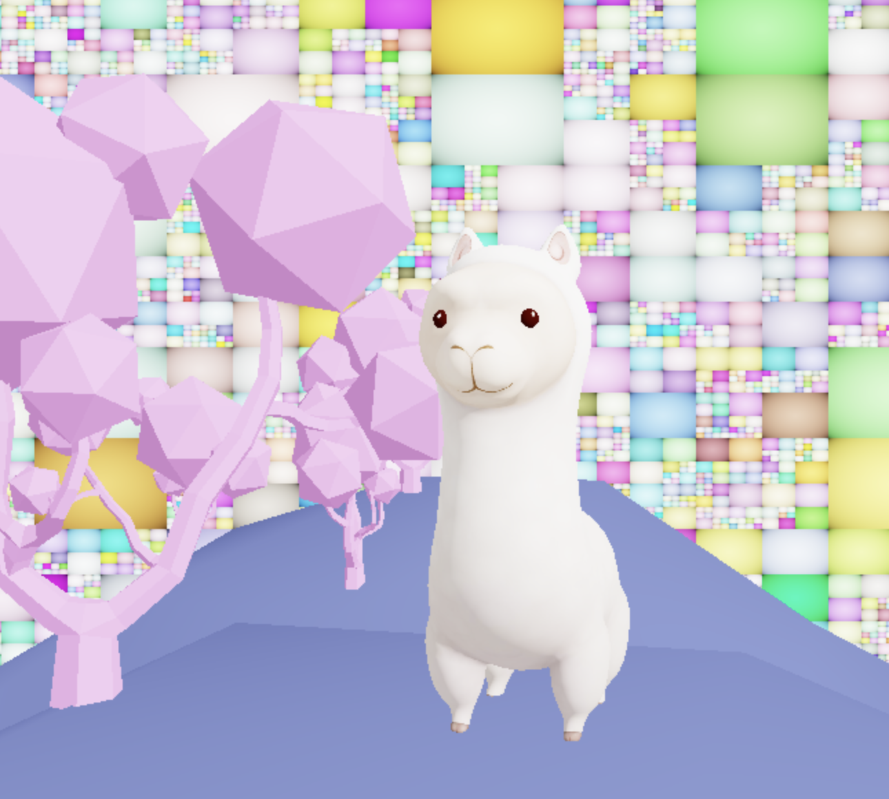
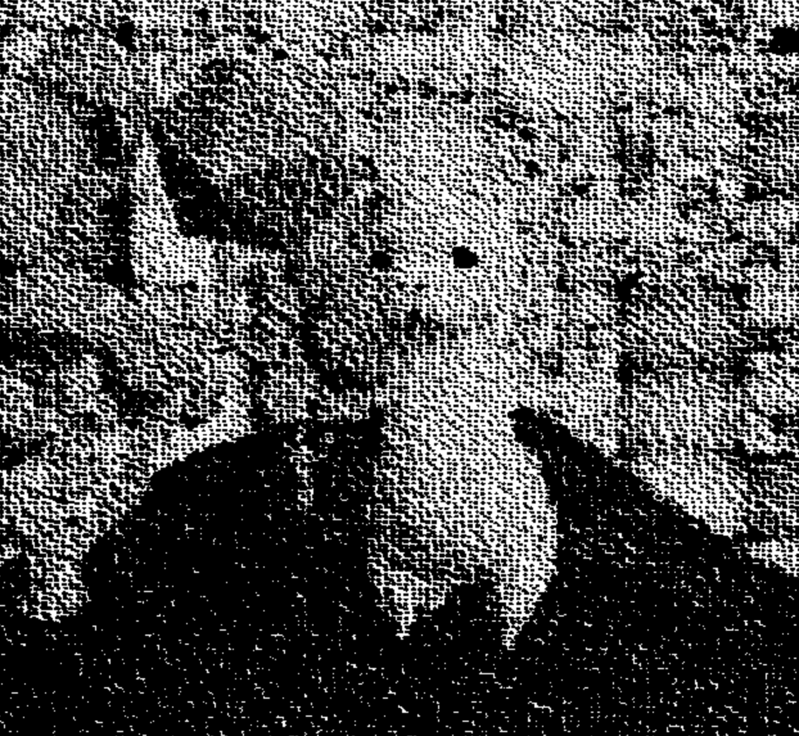
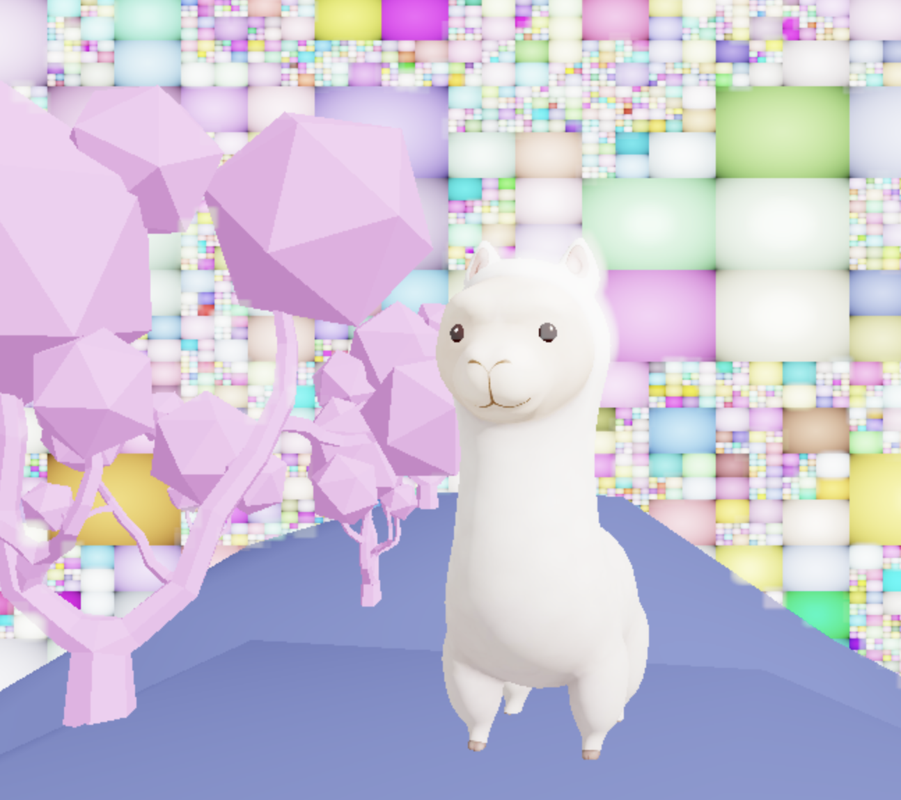
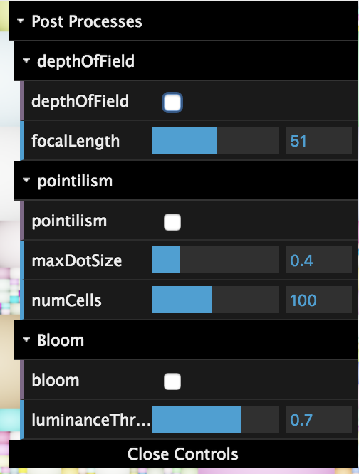

# Kathryn Miller: The Return of Amy Lou Paca

https://kathrynmiller.github.io/homework-7-deferred-renderer-KathrynMiller/

## Reinhard ToneMapping

No Post Processing effects, just Reinhard tonemapping applied and lambertian shading

Background is a take on https://www.shadertoy.com/view/4st3DS 

## Post-process effects
As noted above, you must implement three of the effects listed below to receive full credit for this assignment. __If you previously took CIS 565, one of the effects you implement must come from the list of artistic styling processes__.

If you are unsure exactly how to implement any of these features, you can always come to the course staff for help, but we encourage you to do your own research and find discussions of these techniques online beforehand. You will find yourself doing this fairly often in the "real world" as a programmer, so it's important to develop your searching skills and independence while you're still a student. This isn't CIS 110, so we have no restrictions on you looking up how to implement an algorithm (rather, we encourage it!).

* __Pointilism:__

The screen is divided into a number of cells and each cell randomly generates a point. Based on the luminance of the pixel at the generated point, a dot radius is computed (with a slight offset for variation). The pixel currently being looked at looks at its 9 surrounding cells and if it is within the radius of one of the generated points, it is colored black, otherwise it is colored white.

* __Bloom__
Bloom is applied using three different post process shaders. The first computes the luminance of a pixel using the formula luminance = 0.21 * color[0] + 0.72 * color[1] + 0.07 * color[2] and compares this to a luminance threshold (variable in the controls). Any pixel above this threshold is returned unchanged, otherwise a completely transparent color with an alpha channel of 0 is returned. The next pass takes this image of high luminance pixels and blurs them. The result of this pass is then added to the original image to get a sort of glowy effect for the high luminance areas.

* __Approximated depth of field:__ 
Each pixel has an associated depth and this is subtracted from the camera's z coordinate to get a new relative depth. Then, based on the depth's distance from the focal length of the camera, a kernel length is computed ranging from 1 to 15. The kernel length determines the radius of blurring applied to the pixel to get increasingly blurry background objects.

## Controls

I also added controls so that post processing effects could be modified and layered

